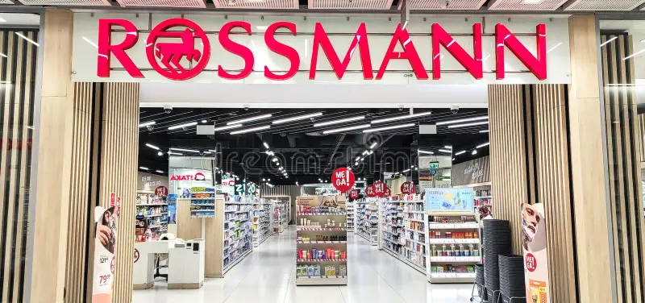
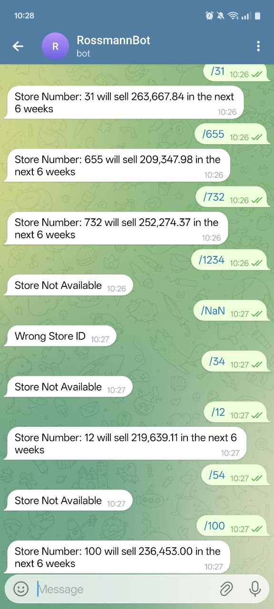

# Rossmann Sales Prediction

## 1.0 Business Problem

Fundada em 1972, a Empresa Rossmann é uma rede de drogarias com mais de 4.000 lojas espalhadas pela Europa em países como Alemanha, Polônia, Hungria e Republica Tcheca. O CFO da empresa, interessado em realizar reformas nas lojas, deseja saber uma previsão de vendas das próximas 6 semanas para saber como deve alocar recusos para a concretização das obras. Com base nos dados disponíveis, era utilizados modelos de média para fazer o forecast das vendas, o que mostrava-se *ineficiente* devido a falta de consideração de eventos sazonais como feriados e férias escolares.

O objetivo deste projeto é reduzir a incerteza na alocação de capital para reformas através de Machine Learning.

## 2.0 Business Hypothesis

Neste primeiro momento, foram levantadas perguntas para suportar a análise de dados que foi feita. Hipóteses do tipo: "Lojas com competidores mais próximos deveriam vender menos" ou "Lojas deveriam vender menos durante os finais de Semana" foram criadas utilizando um Mindmap de Hipóteses. Esse contexto é importante para entendermos o problema com o qual estmaos lidando.

## 3.0 Solution Stategy

Para entregar uma solução rápida e eficaz, o método de trabalho que utilizei foi o CRISP-DS. Esse é um método que foca em entregas periódicas do projeto do qual estamos trabalhando onde, ao final de cada cíclo, uma versão do projeto estará disponível para utilização e que será revista e atualizada periodicamente.

1. Coleta de Dados: Consultas de dados em SQL, Requisições em API
2. Limpeza dos Dados: Descrição dos dados e criação de novas variáveis a partir de variáveis existentes (Feature Engineering)
3. Exploração dos Dados: Enteder o negócio do ponto de vista dos dados, realizando análises variadas e bivariadas, levantamento de hipóteses
4. Modelagem dos Dados: Preparação dos dados para trainamento do modelo, Encoding e transformações de Variáveis, Feature Selection
5. Algoritmos de Machine Learning: Implementação de modelos para teste de performance e escolha do modelo que será usado em produção. Aplicação do Cross-Validation para melhor treinamento do modelo.
6. Avaliação do Algoritmo: Mensuração dos erros do modelo e tradução para o time de negócio.
7. Deploy do Modelo: Disponibilização do modelo em produção e criação do BOT no Telegram.

## 4.0 Top 3 Data Insights

A análise de dados feita no dataset revelaram insights valiosos e que colocam em xeque suposições baseadas apenas em achismos. Alguns exemplos foram:

1. Lojas com competidores mais próximos deveriam vender menos: Podemos concluir que uma maior competitividade gera maior número de vendas. Presume-se que lojas concorrentes, arbitrando preços competitivos, deveriam gerar menos receita mas o gráfico mostra que é exatamente o contrário.

2. Lojas com mais promoções consecutivas deveriam vender mais: Outra suposição interessante é de que promoção consecutivas deveriam atraír mais consumidores, o que é errado. Nota-se uma queda de vendas em semanas do ano onde houve uma extensão da promoção.

3. Lojas deveriam vender mais aos finais de semana: Para este insight, parte-se do pressuposto que lojas deveriam vender mais aos finais de semana e aqui podemos ver que a premissa é falsa. Lojas vendem menos aos finais de semana. Isso pode ser devido a vários fatores mas o mais plausível é que aos domingos, que é representado no gráfico pelo dia 7, as lojas estejam fechadas.

## 5.0 Machine Learning Models Applied

Para solucionar o problema e conseguir prever as vendas para que o CFO consiga alocar os recursos necessários para a reforma das lojas, treinei alguns modelos e realizei a apuração da performance de todos. Os dois que mais se mostraram viáveis foram a Random Forest e o XGBoost. Optei por utilizar o XGBoost justamente pela leveza do algoritmo e porque nas métricas utilizadas para medição, o RMSE ficou muito próximo e se analisarmos o trade-off, não justificaria a utilização de uma RF, conhecida por ser mais pesada. Se a perofmance tivesse tido uma diferença mais discrepante, eu teria seguido um outro caminho.

|Model Name |MAE |MAPE | RMSE |
|Random Forest Regressor |678.296634 |0.099816 |1008.248950 |
|XGBoost Regressor |843.112292 |0.122609 |1250.952634 |
|Average Model |1354.800353 |0.455051 |1835.135542 |
|Linear Regression |1867.089774 |0.292694 |2671.049215 |
|Linear Regression - Lasso |1891.704881 |0.289106 |2744.451737 |

Avaliação do Modelo

|Model Name |MAE |MAPE | RMSE |
|XGBoost Regressor|664.974996 |0.097529 |957.774225 |

## 6.0 Business Results

Mas qual é o retorno que nosso modelo traz quando o traduzimos para resultados de negócio? A tabela abaixo nos traz o melhor e o pior cenário junto com a previsão do modelo:

| Scenario | Values |
|predictions |R$285,860,497.74 |
|worst_scenario |R$285,115,015.68 |
|best_scenario |R$286,605,979.81 |

## 7.0 Next Steps

Para os próximos ciclos, a ideia é entender a causa de algumas lojas estarem com erros na casa dos 50% e analisar o que pode ser feito para diminuir esse número. 

## 8.0 Telegram BOT

Em um BOT no Telegram, o CFO pode acessar nossa aplicação para ver as previsões das lojas apenas inserindo o código:

